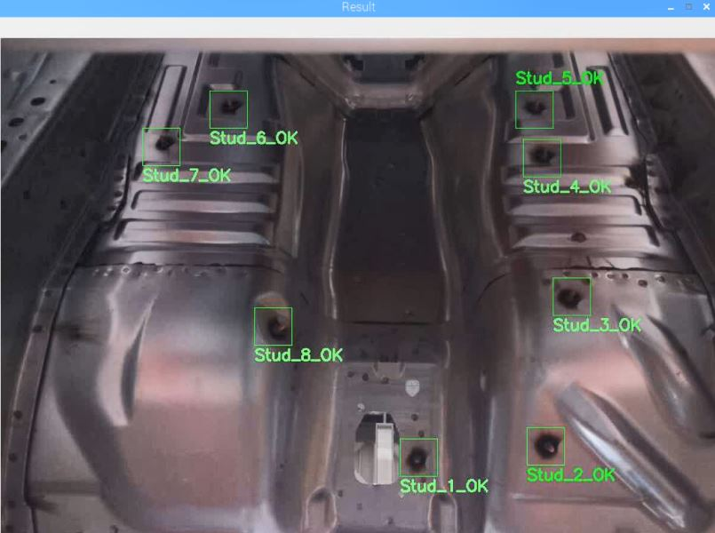
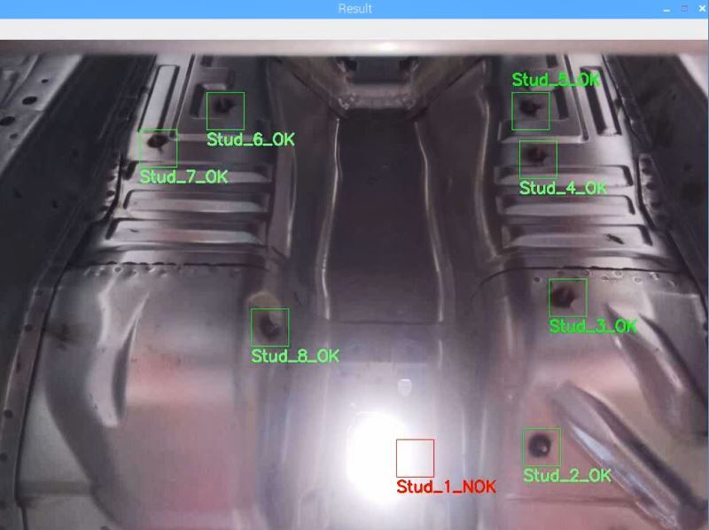

## Stud Detection Application in Automotive Industry

This project has completed by me in an automotive company whether checking studs are exist or not.
#### PS: Please do not hesitate to contact me if you would  have a problem about implementing the code.
#### E-mail: mfbehlul@gmail.com
### Hardware
In this project a Raspberry Pi3 B+ and a Raspberry Camera V2 are used.

### Introduction to Code
HSV code of stud is adjusted. So, contour function can detect easily the stud. If you want to detect any object via its colour, you should just learn the HSV code of your object and give it to the function.
Here is the SS of the program which is running on Raspberry Pi3 B+.

Program can realise easily whether one of the stud is missing or not.

